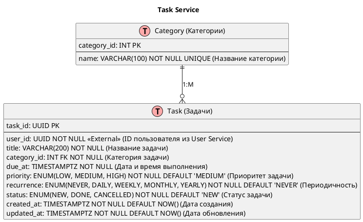

```plantuml
@startuml
!define Table(name,desc) entity name as "desc" << (T,#FFAAAA) >>
title Task Service

Table(Category, "Category (Категории)") {
  category_id: INT PK
  --
  name: VARCHAR(100) NOT NULL UNIQUE (Название категории)
}

Table(Task, "Task (Задачи)") {
  task_id: UUID PK
  --
  user_id: UUID NOT NULL <<External>> (ID пользователя из User Service)
  title: VARCHAR(200) NOT NULL (Название задачи)
  category_id: INT FK NOT NULL (Категория задачи)
  due_at: TIMESTAMPTZ NOT NULL (Дата и время выполнения)
  priority: ENUM(LOW, MEDIUM, HIGH) NOT NULL DEFAULT 'MEDIUM' (Приоритет задачи)
  recurrence: ENUM(NEVER, DAILY, WEEKLY, MONTHLY, YEARLY) NOT NULL DEFAULT 'NEVER' (Периодичность)
  status: ENUM(NEW, DONE, CANCELLED) NOT NULL DEFAULT 'NEW' (Статус задачи)
  created_at: TIMESTAMPTZ NOT NULL DEFAULT NOW() (Дата создания)
  updated_at: TIMESTAMPTZ NOT NULL DEFAULT NOW() (Дата обновления)
}

Category ||--o{ Task : "1:M"

@enduml
```
