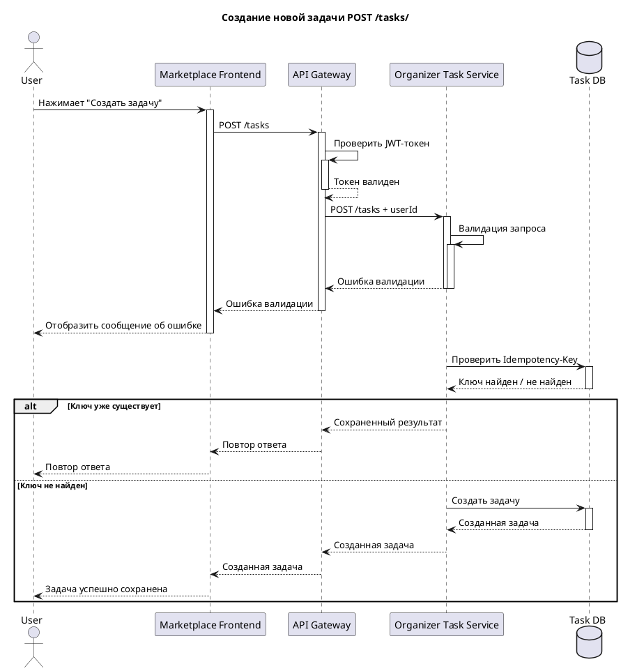

```plantuml
@startuml
title "Создание новой задачи POST /tasks/"


actor User

participant "Marketplace Frontend" as Frontend

participant "API Gateway" as Gateway

participant "Organizer Task Service" as TaskService

database "Task DB" as Database

User -> Frontend: Нажимает "Создать задачу"

activate Frontend

Frontend -> Gateway: POST /tasks

activate Gateway

Gateway -> Gateway: Проверить JWT-токен

activate Gateway

Gateway --> Gateway: Токен валиден

deactivate Gateway

Gateway -> TaskService: POST /tasks + userId

activate TaskService

TaskService -> TaskService: Валидация запроса

activate TaskService

alt Некорректные данные

TaskService --> Gateway: Ошибка валидации

deactivate TaskService

deactivate TaskService

Gateway --> Frontend: Ошибка валидации

deactivate Gateway

Frontend --> User: Отобразить сообщение об ошибке

deactivate Frontend

else Данные корректны

deactivate TaskService

TaskService -> Database: Проверить Idempotency-Key

activate Database

Database --> TaskService: Ключ найден / не найден

deactivate Database

alt Ключ уже существует

TaskService --> Gateway: Сохраненный результат

deactivate TaskService

Gateway --> Frontend: Повтор ответа

deactivate Gateway

Frontend --> User: Повтор ответа

deactivate Frontend

else Ключ не найден

TaskService -> Database: Создать задачу
activate Database

Database --> TaskService: Созданная задача

deactivate Database

TaskService --> Gateway: Созданная задача

deactivate TaskService

Gateway --> Frontend: Созданная задача

deactivate Gateway

Frontend --> User: Задача успешно сохранена

deactivate Frontend

end

@enduml
```
